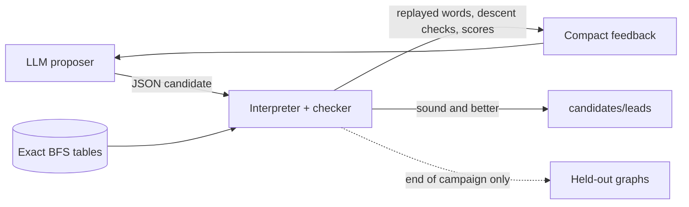

# LRX Lab

Exact computation and LLM-guided program search for an open problem about
sorting with three moves.

Arrange the tokens `1, 2, ..., m` and `r` indistinguishable zeros on a circle
of `n = m + r` cells. Three moves are allowed:

- **L**: rotate everything one cell left
- **R**: rotate everything one cell right
- **X**: swap the first two cells

How many moves does the worst arrangement need to reach the sorted one,
`(1, 2, ..., m, 0, ..., 0)`? That number is the **sorting radius** `E_r(n)`.
It is the eccentricity of the sorted state in a Schreier graph of the LRX
Cayley graph, not the graph's diameter.

## The conjecture (open)

For `m >= 8` and `r >= 2`:

```
E_r(n) <= T_m(n) = m(m+1)/2 + (r-1)(m-2)
```

This repository does **not** prove it. It provides:

1. **Exact ground truth**: complete BFS distance tables for every graph with
   n <= 12, and an exact dynamic program for the manuscript's lifting
   approach.
2. **A verifier-first search loop**: an LLM proposes JSON candidates (sorting
   controllers, potential functions, bounds). A deterministic checker replays
   or certifies every one of them against the exact tables. No LLM judges
   anything.
3. **A claim register** (`research/claims.md`) that separates proven,
   attributed, finite and open statements.

## Results so far

All results are finite unless stated otherwise. Details and evidence:
`research/claims.md`.

| | finding |
|---|---|
| Radii | `E_r(n)` reproduced for 13 graphs (n <= 12) by complete BFS and cross-checked with [cayleypy](https://github.com/cayleypy/cayleypy). Every m >= 8 value equals `T_m(n)` exactly. |
| Lifting (Route B) | The manuscript's candidate `A_P(v) <= P + m - 2` holds on every state of (10,8,2), (11,9,2) and (12,8,4). It **fails on exactly one vector** of each of (10,7,3), (11,8,3) and (12,9,3), confirmed by two independent engines. Allowing one extra projection letter (`P + 1`) repairs every computed graph. |
| Controllers (Route A) | The best LLM-found sorting controller stays within 1.5625 x T on the m >= 8 training probes (the bubble-sort baseline is about 3 x T). Every word is replayed. These are upper bounds on the probed states only. |
| Potentials (Route C) | Two potential functions with short descent arguments that hold for **all m, r**. They give cubic bounds, far weaker than T, but they are the first certificates of this kind here. They were exhaustively certified on 11 complete tables. |

Open problems and next steps: [ROADMAP.md](ROADMAP.md).

## How the search works



- Candidates are JSON in a small expression DSL, interpreted and never
  executed as code.
- Graphs are split into **sanity** (exhaustive; any failure stops evaluation),
  **train** (feedback allowed) and **held-out** (scored once at the end, never
  shown to a proposer).
- Search engines: best-of-n, sequential refinement, and compact
  re-implementations of GEPA (Pareto front with reflective mutation),
  AdaEvolve (islands with adaptive exploration) and EvoX (a strategy that
  evolves).
- The checker, tables, DSL, spend ledger and tests form a hash-locked trusted
  core (`tools/orchestrator.py trusted`). An automated research agent may
  change search code, but not this core.

## Quick start

Python 3.10+. The runtime needs only the standard library; the `lift` command
also needs numpy.

```sh
git clone <this repo> && cd lrx-lab
python -m unittest discover -s tests -p 'test_*.py'   # ~10 s
python -m src.lrx.cli smoke

python -m src.lrx.cli bfs 4 2                          # sorting radius of a small graph
python -m src.lrx.cli family 4 --exact                 # a finite lower-bound certificate

python -m src.lrx.cli table build-registry --workers 8 # ground truth, ~2 min, 123 MB
python -m src.lrx.cli eval candidates/leads/49ab346cb44b2f1b.json
python -m src.lrx.cli certify candidates/probes/6ff08052bb698f26.json 8 3
python -m src.lrx.cli evolve campaigns/offline-rules-gepa.json   # offline search, no API
```

Live LLM campaigns use the xAI API (`XAI_API_KEY` in the environment) and
require an explicit `--allow-network`. The full command reference is in
[docs/usage.md](docs/usage.md).

## Repository map

| path | contents |
|---|---|
| `src/lrx/` | state model, BFS tables, exact DP, certificates, DSL, evaluator, search engines, LLM client, reports |
| `tests/` | about 285 unit tests, including an independent literal-vector oracle |
| `research/` | problem statement, claim register, experiment protocol |
| `candidates/` | baselines, best controllers (`leads/`), potentials and probes (`probes/`) |
| `campaigns/` | example campaign configs (offline and live) |
| `datasets/` | graph registry and table hash lock; tables are generated locally |
| `evidence/` | JSON outputs of the exact lifting checks and potential certifications cited in the claims |
| `autoresearch/` | agent operating manual, Route B scripts and findings, session reports |
| `integrations/`, `tools/` | official GEPA shim, cayleypy cross-check, orchestrator helpers |
| `references/` | sources and attribution |

## Ground rules

These rules apply to every claim in this repository:

- A replayed word proves an upper bound for that one state. A failed or long
  heuristic search is never a lower bound.
- Resource limits produce INCOMPLETE, never infinity.
- A finite check is a statement about that graph only. A pattern across
  graphs, or a model's explanation, is not a proof.
- Held-out results never reach a prompt or feedback.
- Model-generated code is never executed.

## Sources

The exact recurrences, the 6k-2 obstruction family and the lifting candidate
come from an unpublished manuscript. The empirical radius formula comes from
unpublished progress notes. Neither is distributed here. Both are cited in
[references/source-manifest.md](references/source-manifest.md), and every
result taken from them is attributed in `research/claims.md`.

## License

[MIT](LICENSE)
