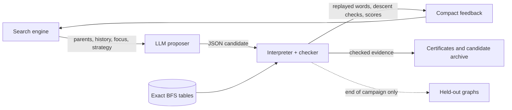

# LRX Lab

Exact computation and LLM-guided program search for an open problem about
sorting with three moves.

Arrange the tokens `1, 2, ..., m` and `r` indistinguishable zeros on a circle
of `n = m + r` cells. Three moves are allowed:

- **L**: rotate everything one cell left
- **R**: rotate everything one cell right
- **X**: swap the first two cells

How many moves does the worst arrangement need to reach the sorted one,
`(1, 2, ..., m, 0, ..., 0)`? That number is the **sorting radius** `E_r(n)`.
It is the eccentricity of the sorted state in a Schreier graph of the LRX
Cayley graph, not the graph's diameter.

## The conjecture (open)

For `m >= 8` and `r >= 2`:

```
E_r(n) <= T_m(n) = m(m+1)/2 + (r-1)(m-2)
```

This repository does **not** prove it. It provides:

1. **Exact ground truth**: complete BFS distance tables for registered finite
   graphs, and an exact dynamic program for the manuscript's lifting approach.
2. **A verifier-first search loop**: an LLM proposes JSON candidates (sorting
   controllers, potential functions, bounds, lifting policies, and mixture word policies). A
   deterministic checker replays or certifies them using exact tables and
   explicit word checks. No LLM judges anything.
3. **A claim register** (`research/claims.md`) that separates proven,
   attributed, finite and open statements.

An [official framework program-search pilot](integrations/official-research.md)
now runs separately. It uses generated Python under an OS sandbox,
frozen development families, and trusted replay. Its offline framework smokes
are documented in [the integration report](autoresearch/official-integration-260924/report.md);
the subsequent [bounded live iteration](autoresearch/loop-260924-live/report.md)
found one independent deterministic named-family certificate and no paid-arm
improvement. A [follow-on protocol](autoresearch/loop-260924-protocol/REPORT.md)
now freezes that 15/16 all-cuts control as incumbent, retains a new sealed
16-case structural confirmation set, and exercises per-reflection development
archive refresh in native GEPA with a mock broker. A separate synthetic graded
fixture checks GEPA's selection path. Neither offline check is a mathematical
gain or a new paid campaign. Automatic approval review rejected the prepared
Grok launch before process start because the new private payload lacks
specific authorization; this session made no live call.
None of these results establishes a broader theorem or an engine ranking.

## Results so far

The general conjecture and full m = 8 case remain open. All results below
are finite unless explicitly stated otherwise. Details and evidence:
`research/claims.md`.

| | finding |
|---|---|
| Radii | `E_r(n)` reproduced for 13 graphs (n <= 12) by complete BFS and cross-checked with [cayleypy](https://github.com/cayleypy/cayleypy). Every m >= 8 value equals `T_m(n)` exactly. |
| Lifting (Route B) | The manuscript's candidate `A_P(v) <= P + m - 2` holds on every state of (10,8,2), (11,9,2) and (12,8,4). It **fails on exactly one vector** of each of (10,7,3), (11,8,3) and (12,9,3), confirmed by two independent engines. Allowing one extra projection letter (`P + 1`) repairs every computed graph. |
| Controllers (Route A) | The best LLM-found sorting controller stays within 1.5625 x T on the m >= 8 training probes (the bubble-sort baseline is about 3 x T). Every word is replayed. These are upper bounds on the probed states only. |
| Potentials (Route C) | Two potential functions with short descent arguments that hold for **all m, r**. They give cubic bounds, far weaker than T, but they are the first certificates of this kind here. They were exhaustively certified on 11 complete tables. |

### Recent results and their limits

- **Official program-search iteration (2026-09-24).** On 16 frozen m=8
  development families with 4–7 zero blocks, the fixed direct catalog
  certifies 12, the original four-cut seed 14, and an independent post-hoc
  all-cuts control **15**. The added k6 family has an exact all-positive-length
  direct-word mixture certificate; k5 remains uncertified. Paid GEPA,
  AdaEvolve, and EvoX runs added **zero** development certificates beyond
  their input. One-shot sealed confirmation gave the catalog and all four
  frozen finalists the same **6/8**, with zero addition over catalog.
  Broker accounting records 18 upstream attempts and **$1.902142
  conservatively accounted**, including full reservations for three timed-out
  calls whose provider bills are unknown. This is a sequential research
  portfolio, not a matched engine comparison. See the [final live report](autoresearch/loop-260924-live/report.md).

- **LLM mixture search (session 09).** EvoX and sequential now search JSON word-construction policies. For **$0.33641**, finalists add **five distinct all-length family certificates** beyond the fixed catalog baseline: four development and one fresh confirmation. Both certify 23/30 confirmation families versus 22/30 for the catalog; no engine ranking follows. Including expanded catalog search, this iteration records 41 distinct named certificates. See the [session 09 report](autoresearch/loop-260924-optimizer/report.md).

- **New projected mixtures (session 08).** A deterministic, dependency-free
  optimizer produced **76 exact certificates for named m = 8 families with
  4–8 zero blocks**, covering all positive block lengths through the reviewed
  comparison/stretching lemmas: 52/100 development and 24/50 confirmation
  families. Sixty certificates reuse inherited word supports with new weights;
  sixteen use additional existing catalog words. API cost: **$0**. Selected
  baseline exclusions were rechecked; global coverage totals were not
  reconstructed. See the [session 08 report](autoresearch/loop-260923-2154/report.md).
- **Nine-gap theorem at m = 8 (supplied manuscript).** For every order of the
  eight labels and arbitrary positive zero-block lengths in all nine linear
  gaps, including both endpoints, `d(v) <= 6n - 18`. We independently checked
  its 40,320 rational mixture certificates, 4,670 reference words, 152,937
  mixture rows and 42,030 literal stretching checks. The manuscript's
  comparison and stretching lemmas turn these certificates into a result for
  **all positive lengths**, not just sampled states. This is not full m = 8
  or a proof of the general conjecture.
- **Coverage accounting remains partly attributed.** The manuscript reports
  12,680,558 families covered by projection and 16,107,991 after union with
  earlier results, leaving 4,495,529 families with 4–8 blocks. We have not
  independently reconstructed those totals. The union uses a previous
  <=3-block theorem whose large data are not included in the supplied archive.
- **Engine-driven lifting pilot.** On 28 hard development vectors, the fixed
  geodesic baseline certifies 20 within the target, sequential certifies 22,
  and EvoX certifies 24. All three pass 120 fresh random confirmation vectors;
  that set does not distinguish them. Each paid arm used 12 proposals; total
  reported cost was **$0.782758**. EvoX applied two strategy rewrites, but its
  best policy preceded them. This is not evidence of an engine ranking.
- **A concrete construction improvement.** Both finalists certify
  `A_58(v) <= 66` for the documented (9,4) band-edge vector. Compared with the
  six-geodesic baseline, two extra projected steps save four repair moves.
  The hard (8,3) obstruction remains a portfolio miss, not a counterexample.

Evidence: [session 07 report](autoresearch/loop-260923-2107/report.md),
[nine-gap audit and scope](autoresearch/loop-260923-2107/paper-review.md), and
[source archive](autoresearch/loop-260923-2107/incoming/verification.zip).

### Current priority: new mixtures after projection

A single fixed stretching word can have a block-length coefficient above the
required value 6. A portfolio can compensate: choose nonnegative rational
weights summing to one such that, for k retained blocks,

```
weighted base cost < 31 + 6k
weighted coefficient of every retained block <= 6
```

Then at least one word meets the target for every positive choice of block
lengths. The completed local experiment found new weights for existing projected
words. The next experiment will widen the catalog beyond its 128-word pool
before seeking new words. An old mixture
failing after deletion does not show that every new mixture fails.

The primary outcome is newly certified infinite families. The data-only
mixture adapter works with all four local planners and was used in session09.
The separate official framework pilot evaluates executable word constructors
against frozen structural families. Its live iteration found a deterministic
all-cuts k6 certificate but no paid-search addition; the next official
program-search target is the exact reduced-cost face of the remaining k5
family. The [prepared protocol](autoresearch/loop-260924-protocol/REPORT.md)
adds the all-cuts incumbent automatically to each trusted evaluation, so
proposers can focus on up to 32 additional words per case. The new structural
confirmation set remains sealed. The prepared live launch was rejected before
process start by automatic approval review pending specific payload approval.
The mixture profile interpreter, numerical optimizer and exact rational
acceptance checks are implemented. See the [next-iteration
protocol](autoresearch/next-iteration.md), [ROADMAP.md](ROADMAP.md), and current
[HANDOFF.md](HANDOFF.md).

## How the search works



- Candidates are constrained JSON policies or expressions, interpreted and
  never executed as generated code in the original campaigns. The separate
  official-framework pilot evaluates generated `propose_words` programs inside
  an OS sandbox; its evaluator and frozen evidence are outside candidate control.
- For controller and potential campaigns, graphs are split into **sanity**
  (exhaustive; any failure stops evaluation),
  **train** (feedback allowed) and **held-out** (scored once at the end, never
  shown to a proposer).
- Search engines: best-of-n, sequential refinement, and compact
  re-implementations of GEPA (Pareto front with reflective mutation),
  AdaEvolve (islands with adaptive exploration) and EvoX (a strategy that
  evolves).
- Lifting campaigns instead use frozen development vectors and a separate
  confirmation set, with exact fixed-word routing and trusted word replay.
  All four adaptive planners support this adapter; the new paid pilot tested
  only sequential and EvoX. See [lifting search](integrations/lift-search.md).
- Mathematical context is versioned and evidence-linked. Parent feedback,
  histories and strategies evolve within a campaign; reflections cannot
  promote a hypothesis into a proved fact. Confirmation never enters context.
- The checker, tables, DSL, spend ledger and existing core tests form a
  hash-locked trusted core (`tools/orchestrator.py trusted`). An automated research agent may
  change search code, but not this core.

## Quick start

Python 3.10+. The runtime needs only the standard library; the `lift` command
also needs numpy.

```sh
git clone https://github.com/Archelunch/lrx-solver.git && cd lrx-solver
python -m unittest discover -s tests -p 'test_*.py'   # ~10 s
python -m src.lrx.cli smoke

python -m src.lrx.cli bfs 4 2                          # sorting radius of a small graph
python -m src.lrx.cli family 4 --exact                 # a finite lower-bound certificate

python -m src.lrx.cli table build-registry --workers 8 # ground truth, ~2 min, 123 MB
python -m src.lrx.cli eval candidates/leads/49ab346cb44b2f1b.json
python -m src.lrx.cli certify candidates/probes/6ff08052bb698f26.json 8 3
python -m src.lrx.cli evolve campaigns/offline-rules-gepa.json   # offline search, no API
```

Live LLM campaigns use the xAI API (`XAI_API_KEY` in the environment) and
require an explicit `--allow-network`. The full command reference is in
[docs/usage.md](docs/usage.md).

The supplied nine-gap certificate archive can be checked without API calls,
BFS tables, NumPy, or executing any archive code. Use a fresh output path:

```sh
python -m integrations.nine_gap_audit \
  autoresearch/loop-260923-2107/incoming/verification.zip \
  /tmp/lrx-nine-gap-audit.json
```

This checks the nine-gap certificate premises. It does not reconstruct the
projection-union counts or replace the mathematical stretching lemmas.

## Repository map

| path | contents |
|---|---|
| `src/lrx/` | state model, BFS tables, exact DP, certificates, DSL, evaluator, search engines, LLM client, reports |
| `tests/` | 327 unit tests, including an independent literal-vector oracle |
| `research/` | problem statement, claim register, experiment protocol |
| `candidates/` | baselines, best controllers (`leads/`), potentials and probes (`probes/`) |
| `campaigns/` | example campaign configs (offline and live) |
| `datasets/` | graph registry and table hash lock; tables are generated locally |
| `evidence/` | JSON outputs of the exact lifting checks and potential certifications cited in the claims |
| `autoresearch/` | agent operating manual, Route B scripts and findings, session reports |
| `integrations/`, `tools/` | lifting-policy adapter, independent nine-gap auditor, official GEPA shim, cayleypy cross-check, orchestrator helpers |
| `references/` | sources and attribution |

## Ground rules

These rules apply to every claim in this repository:

- A replayed word proves an upper bound for that one state. A failed or long
  heuristic search is never a lower bound.
- Resource limits produce INCOMPLETE, never infinity.
- A finite check is a statement about that graph only. A pattern across
  graphs, or a model's explanation, is not a proof.
- Held-out results never reach a prompt or feedback.
- In the official-framework pilot only, generated code runs under the bounded
  evaluator sandbox described in [the integration guide](integrations/official-research.md).

## Sources

The exact recurrences, the 6k-2 obstruction family and the lifting candidate
come from an unpublished manuscript. The empirical radius formula comes from
unpublished progress notes. Neither is distributed here. Both are cited in
[references/source-manifest.md](references/source-manifest.md), and every
result taken from them is attributed in `research/claims.md`.

The newer supplied nine-gap theorem is a separate source. Its embedded
verification archive and original Russian theorem text are preserved under
`autoresearch/loop-260923-2107/incoming/`; the English review records exactly
what was independently checked. See the source manifest for hashes and scope.
Repository summaries and the README are maintained in English; original source
material is retained in its original language.

## License

[MIT](LICENSE)
